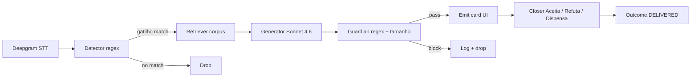

# SKU Spec — Co-pilot de sugestões ao vivo para closers consultivos

> **Princípio Constitution C2**: este documento começa pela cláusula contratual de outcome. Stack, prompts e código vêm depois.
> **Princípio Constitution C1**: nenhum SKU vai além de `status: draft` sem Diagnóstico Fase 0 vinculado. Vínculo: [`diagnostic-live-suggestion-copilot.md`](../clients/novais-digital-internal/diagnostic-live-suggestion-copilot.md).

---

## 1. Cláusula contratual de outcome (C2 — obrigatório)

### 1.1. Definição do outcome em uma frase

```
Uma sugestão é considerada DELIVERED quando o co-pilot emite ao closer
um card curto (≤280 chars, zero brand leakage, voz consultiva) em ≤3s
após a detecção de um gatilho do cliente durante a ligação ao vivo, e
o closer registra explicitamente Aceitar / Refutar / Dispensar OU usa
a fala no áudio em ≤30s da emissão.
```

> Frase ipsis literis copiada de `diagnostic.proposed_outcome.clause`. Legível por advogado e CEO. Mudança aqui exige novo `/novais-digital:diagnose`.

### 1.2. Três exemplos POSITIVOS (casos que CONTAM)

| # | Descrição concreta do caso |
|---|---|
| 1 | Cliente fala **"está caro"** em `estado=apresentação` → co-pilot emite em 2.8s: *"O desconforto é com o valor em si ou ainda está pesando se faz sentido pra sua situação? Me ajuda a entender onde tá a dúvida."* — closer marca 👍. |
| 2 | Cliente fala **"vou pensar"** em `estado=fechamento` → co-pilot emite em 2.5s: *"O que exatamente você quer pensar: o valor, a cobertura ou a decisão em si?"* — closer usa fala parcial em 18s. |
| 3 | Cliente fala **"prefiro investir em CDB"** em `estado=apresentação` → co-pilot emite em 2.9s: *"CDB constrói patrimônio com o tempo. Se acontecer algo antes do saldo chegar lá, quem cobre o gap pra sua família?"* — closer marca 👍. |

### 1.3. Três exemplos NEGATIVOS (casos parecidos que NÃO contam)

| # | Descrição | Por que NÃO conta |
|---|---|---|
| 1 | Cliente conversa sobre família ("minha esposa e dois filhos") sem objeção em `estado=diagnóstico` | Não há gatilho detectado — nada para sugerir; emissão seria interrupção. |
| 2 | Closer acabou de fazer pergunta aberta ("o que te preocupa hoje?") e cliente ainda processando (silêncio <8s) | Regra de timing — interromper janela de resposta do cliente quebra o método consultivo (D004). |
| 3 | `estado=encerramento` e cliente já disse "fechado, pode enviar contrato" | Decisão tomada — sugestão tardia é ruído; constitution-extension §3 proíbe. |

### 1.4. Janela temporal de estabilidade

`0h imediato` (real-time)

**Justificativa**: a natureza da sugestão é ao vivo. O valor entregue colapsa para zero se passar de 3s da detecção do gatilho — o closer já terá respondido sem o co-pilot ou perdido o momento. Outcome é estável no instante da emissão; não há reprocessamento posterior.

### 1.5. Evento técnico que dispara `Outcome.status = DELIVERED`

`suggestion.emitted` registrado em LangSmith com:
- `trace_id` não-nulo
- `latency_ms ≤ 3000`
- `guardian_result = pass` (zero brand leak, ≤280 chars)
- `closer_action ∈ {accepted, dismissed, ignored, refuted}` resolvido em ≤60s

`suggestion.accepted` adicional dispara `Outcome.status = ACCEPTED` (subset de DELIVERED para agreement_rate).

### 1.6. Aprovação contratual

- [ ] CEO aprovou redação (Rafael — pendente)
- [ ] Cliente assinou cláusula (Novais Digital é cliente interno — N/A no momento)
- [ ] Definição passa no teste do "advogado naive" (legível sem jargão técnico)
- [ ] Texto de consentimento LGPD aprovado (ADR-002 dependente)

---

## 2. Categorias de outcome (alimenta D6 e eval suite)

| Código | Descrição | Threshold mínimo de acurácia |
|---|---|---|
| `vou_pensar` | Cliente sinaliza adiamento de decisão sem objeção explícita | 70% |
| `esta_caro` | Cliente sinaliza objeção de preço/valor | 70% |
| `prefiro_investir` | Cliente compara proteção com investimento (CDB, ações, etc.) | 70% |
| `ja_tenho_seguro` | Cliente declara já possuir produto/cobertura | 70% |
| `quero_pesquisar` | Cliente quer comparar com outras opções de mercado | 70% |
| `falar_com_conjuge` | Cliente posterga citando decisão conjunta | 70% |
| `sem_tempo_agora` | Cliente sinaliza indisponibilidade de tempo na call | 70% |
| `desconfianca_seguradora` | Cliente expressa ceticismo institucional | 70% |
| `apresentacao_premium_alto` | Closer apresentou prêmio e cliente reagiu negativamente | 70% |
| `fechamento_estagnado` | Conversa em loop sem progresso de etapa | 70% |

**Threshold agregado** (média ponderada por volume): **70%** em SHADOW, **80%** em ASSISTED, **90%** em AUTONOMOUS.

> Detalhe completo em `docs/clients/novais-digital-internal/sla-live-suggestion-copilot.md` (a criar via `/novais-digital:sla-threshold`).

---

## 3. Fontes de input

### 3.1. Canal de entrada
- Tipo: **Browser STT streaming (Deepgram Nova-3 PT-BR)** — captura áudio do mic do closer durante a call Zoom/Meet
- Adapter implementado em: [`apps/web-poc/`](../../apps/web-poc/) (POC); migração para `src/adapters/stt/deepgram/` antes de SHADOW (débito C7)
- Volume esperado: ~100 ligações/closer/mês × N closers

### 3.2. Trigger de pipeline
- Evento que enfileira job: `POST /api/suggest { buffer: string[], estado: string }` (Hono server)
- Job name: `live-suggestion`
- Fila: in-process (sem queue real no MVP — async direto)

### 3.3. Contexto consumido (C5 three-tier)

| Tier | O que lê | Path |
|---|---|---|
| L0 | DNA Novais Digital, ICP, princípios universais de venda consultiva, corpus sanitizado | `corpus/clean/`, `docs/foundry/`, constitution |
| L1 | Configuração da corretora (tom, glossário, opt-in LGPD), perfil do closer | `TenantContext.skuConfig.live-suggestion-copilot` (a implementar) |
| L2 | Buffer de turnos da chamada atual, estado da conversa, gatilhos já emitidos | run-scope em memória (não persistido até consentimento) |

---

## 4. Pipeline de agentes

### 4.1. Diagrama (LangGraph conceitual)



### 4.2. Nodes detalhados

| Node | Modelo | Responsabilidade | Output |
|---|---|---|---|
| `detector` | regex (10 gatilhos) | Detecta gatilho no último turno do cliente | `Trigger[]` ou `[]` |
| `retriever` | scoring lexical | Top-3 chunks do corpus com tag match | `Chunk[]` |
| `generator` | Claude Sonnet 4.6 | Compõe sugestão consultiva (1-2 linhas) | `text + usage` |
| `guardian` | regex + len | Rejeita brand leak / >280 chars | pass ou block |
| `emit` | (UI) | Renderiza card com 3 botões | evento WebSocket |

### 4.3. Telemetria (C6)

Toda chamada LLM **deve** estar instrumentada via `observe(...)` em [`src/observability/trace.ts`](../../src/observability/trace.ts). Cada `Outcome` referencia `trace_id` LangSmith.

**Status atual**: wrapper integrado no Anthropic adapter; ativação condicionada a `LANGCHAIN_API_KEY`. Antes de SHADOW: criar conta smith.langchain.com, validar `trace_coverage ≥ 99%` por 7 dias.

---

## 5. Eval suite

- **Localização**: [`evals/live-suggestion-copilot/cases/`](../../evals/live-suggestion-copilot/cases/) (a criar)
- **Casos mínimos**: 30 por outcome_category (C4 hard gate)
- **Recomendado**: 50 casos totais antes de SHADOW; 100+ antes de AUTONOMOUS
- **Mix obrigatório**: ≤40% sintético; resto real (transcrições anonimizadas) + edge + adversarial
- **Atualização**: trimestral ou após drift detectado pelo reviewer DeepAgent

Cada caso usa [`templates/eval-case.template.md`](../../templates/eval-case.template.md).

---

## 6. Unit economics

> Detalhe completo em `docs/clients/novais-digital-internal/delivery-economics-live-suggestion-copilot.md` (a criar via `/novais-digital:unit-economics`). Preview:

| Métrica | Valor preliminar |
|---|---|
| Tokens médios in/out por sugestão | ~1200 in / ~80 out (com cache) |
| Custo por sugestão (medido em 2026-05-20) | **R$ 0,0248** |
| Preço por outcome (sugestão aceita) | TBD — definir em /novais-digital:unit-economics |
| Preço de plataforma fixa | TBD R$/closer/mês |
| **Razão custo/preço** | **TBD%** — gate C3 ≤25% |

**Baseline humano pendente** — entrevistar 2-3 closers seniores antes de SHADOW para preencher custo-hora, conversão atual, tempo médio de call.

---

## 7. Modos e gates de promoção

| Modo | Gate para promover | Critério |
|---|---|---|
| SHADOW | → ASSISTED | `agreement_rate ≥ 70%` em ≥ 200 sugestões emitidas em ≥ 14 dias com 3-5 closers paralelos |
| ASSISTED | → AUTONOMOUS | `agreement_rate ≥ 80%` em ≥ 1000 sugestões em ≥ 30 dias; `brand_leak_rate = 0`; CI/CD ativo |
| AUTONOMOUS | (steady state) | `false_positive_rate ≤ 3%` rolling 7-dias; auditoria mensal verde |

> Promoção via `/novais-digital:promote --to=<modo>`. Validação cross-approval por Promotion Officer + PO Guardian.

**Janela mínima** (C4): 14 dias para módulos `critical` (este SKU é critical).

---

## 8. Configuração por tenant (C8)

> Cliente novo do mesmo SKU = configuração, **não** branch. Variáveis de tenant abaixo:

| Campo | Tipo | Default | Exemplo |
|---|---|---|---|
| `tone_of_voice` | enum | `"consultivo-neutro"` | `"consultivo-empático"` |
| `glossario_proibido` | string[] | `[]` (herda do global) | `["produto-x", "marca-y"]` |
| `gatilhos_ativos` | string[] | `all` | `["esta_caro", "vou_pensar"]` |
| `latency_target_ms` | int | `3000` | `2500` |
| `consent_text_lgpd` | string | (default Novais Digital) | string custom aprovada pelo jurídico do tenant |
| `closer_profile_seniority` | enum | `"medio"` | `"junior" \| "medio" \| "senior"` |

Tudo isso vive em `TenantContext.skuConfig.live-suggestion-copilot`. Nada de `if (tenantId === '...')` no código (C8).

---

## 9. Riscos específicos deste SKU

| Risco | Mitigação |
|---|---|
| Brand leak em sugestão emitida (LGPD + IP) | 3 camadas: corpus sanitizado no ingest + system prompt com proibidos + guardian regex no runtime |
| Latência >3s (closer perde momento) | Sonnet 4.6 + top-K=3 + buffer 4 turnos + prompt cache; medir p95 contínuo |
| Sugestão em momento errado (ruído) | Detector regex conservador + estado da conversa como filtro + cooldown 30s entre sugestões |
| Falha de transcrição (audio ruim) | Deepgram nova-3 com fallback nova-2; interim_results para reduzir lag |
| Captura de PII do cliente em buffer | Buffer in-memory, não persistido sem consentimento explícito (ADR-002) |
| Closer fica dependente do co-pilot | Modo SHADOW invisível para closer (sugestões só vão para log) durante baseline measurement |
| Drift do detector ao evoluir corpus | Auditoria mensal DeepAgent + revisão de gatilhos a cada 90 dias |

---

## 10. SLA Thresholds — C4 (imutáveis durante SHADOW)

> Definidos via `/novais-digital:sla-threshold` em 2026-05-20. Aprovados por **Rafael Novaes (Novais Digital — PO Guardian)**. Imutáveis durante janela SHADOW ativa — ajuste exige nova janela e nova aprovação.

### Gate SHADOW → ASSISTED

| Threshold | Valor | Derivação |
|---|---|---|
| `agreement_rate_min` | **≥ 70%** | Diagnostic Bloco 6 (ASSISTED gate) — SHADOW gate é ≥50%, pré-contratamos o mais rigoroso direto |
| `latency_p95_ms` | **≤ 3.000ms** | Diagnostic Bloco 6 + medido na POC (3.124ms — margem de otimização prevista via cache) |
| `brand_leak_rate_max` | **0** | Hard gate — LGPD + IP (ADR-002); constitution-extension §3 |
| `cost_per_suggestion_max_brl` | **R$ 0,041** | C3: 25% × R$0,163 (preço implícito por sugestão em R$49/closer/mês) |
| `min_run_count` | **200 sugestões** | Volume mínimo para significância estatística em agreement_rate |
| `min_window_days` | **14 dias** | C4 hard floor (módulo classificado como `critical`) |

### Gate ASSISTED → AUTONOMOUS

| Threshold | Valor |
|---|---|
| `agreement_rate_min` | ≥ 80% |
| `latency_p95_ms` | ≤ 2.500ms |
| `brand_leak_rate_max` | 0 |
| `min_run_count` | ≥ 1.000 sugestões |
| `min_window_days` | ≥ 30 dias |
| CI/CD pipeline ativo | obrigatório |

### Categorias de escalação (sempre rollback imediato)

| Categoria | Motivo |
|---|---|
| `brand_leak_detected` | Vazamento de IP/marca — LGPD + ADR-002 |
| `pii_in_suggestion` | PII do cliente na sugestão — LGPD hard gate |

`quality_breach_action`: **rollback** imediato para ambas.

### Audit trail

```yaml
sla_approved_by: "Rafael Novaes (Novais Digital — PO Guardian)"
sla_approved_at: "2026-05-20T00:00:00Z"
sla_signature_hash: "sha256:b3f1a0e2c9d84b17"
```

---

## 11. Histórico de versões

| Versão | Data | Mudança | Autor |
|---|---|---|---|
| 0.1.0 | 2026-05-20 | Spec inicial formalizada (retroativa ao MVP) | Rafael Novaes |
| 0.1.1 | 2026-05-20 | c4_thresholds adicionados via /novais-digital:sla-threshold | Rafael Novaes |

---

## Checklist de pronto (gate G1 — Spec & Economics)

- [x] §1 cláusula contratual completa (C2) — pendente assinatura do decisor + LGPD
- [x] §2 categorias e thresholds definidos (10 categorias)
- [x] §3 canal e adapter identificados (Deepgram via POC; migração C7 antes de SHADOW)
- [x] §4 pipeline implementado em [`apps/api/src/`](../../apps/api/src/)
- [ ] §5 eval suite com ≥30 casos por categoria — **a criar**
- [ ] §6 unit economics passa regra C3 (≤25%) — **rodar `/novais-digital:unit-economics`**
- [x] §7 gates de promoção configurados
- [x] §8 configuração por tenant declarada (TenantContext a implementar antes de SHADOW)
- [x] Diagnóstico Fase 0 vinculado (C1)
- [ ] Telemetria LangSmith ativa (`LANGCHAIN_API_KEY` definida + trace_coverage validado) — **C6 débito**
