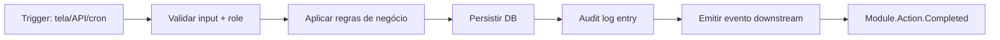

# Module Spec — {{ module_name }}

> **Princípio Constitution C2**: este documento começa pela cláusula contratual de outcome operacional. Stack, UI e código vêm depois.
> **Princípio Constitution C1**: nenhum módulo vai além de `lifecycle_state: DRAFT` sem Diagnóstico vinculado.
> **Tipo**: módulo de plataforma SaaS/operacional. Outcome = ação operacional verificável (tela, payload, dado persistido, evento auditável). NÃO é classificação por agente IA.

---

## 1. Cláusula contratual de outcome (C2 — obrigatório)

### 1.1. Definição do outcome em uma frase

```
{{ Ação operacional X é considerada concluída quando o usuário/sistema
   {VERBO} e {EFEITO OBSERVÁVEL: dado persistido / tela atualizada /
   evento emitido / integração respondendo 2xx} }}
```

> Esta frase vai literalmente para o critério de aceite. Tem que ser legível por PO e usuário-final.

### 1.2. Três exemplos POSITIVOS (casos que CONTAM como concluído)

| # | Cenário | Evidência observável |
|---|---|---|
| 1 | {{ caso real e detalhado }} | {{ ex: row em `tabela_x` com status='ATIVO' E audit log entry `ModuleX.action.completed` }} |
| 2 | {{ caso real }} | {{ evidência }} |
| 3 | {{ caso real }} | {{ evidência }} |

### 1.3. Três exemplos NEGATIVOS (casos parecidos que NÃO contam)

| # | Cenário | Por que NÃO conta |
|---|---|---|
| 1 | {{ caso de borda }} | {{ razão — ex: row criada mas sem audit log = inconsistência }} |
| 2 | {{ caso }} | {{ razão }} |
| 3 | {{ caso }} | {{ razão }} |

### 1.4. Janela temporal de estabilidade

`{{ síncrono / 24h / 72h / 7d / batch noturno }}`

**Justificativa**: {{ por que essa janela faz sentido para este módulo }}

### 1.5. Evento técnico que dispara `COMPLETED`

```
event_name: "{{ Module.Action.Completed }}"
payload_schema: {{ ref a schemas/event-{{ module_id }}.json }}
emitted_to:
  - audit_log: "audit_events" table / Elastic index / Datadog log
  - structured_logger: stdout JSON
  - downstream: {{ webhooks, outras integrações }}
```

### 1.6. Aprovação contratual

- [ ] PO aprovou redação do critério de aceite
- [ ] Decisor do cliente assinou cláusula no contrato (para módulos críticos)
- [ ] Definição passa no teste do "PO/usuário naive" (legível sem jargão técnico)

---

## 2. Categorias de ação (alimenta C4 / aceite humano)

| Código | Descrição | Critério de pass |
|---|---|---|
| `{{ acao-1 }}` | {{ ... }} | {{ teste E2E + audit log entry }} |
| `{{ acao-2 }}` | {{ ... }} | {{ teste E2E + audit log entry }} |
| `{{ acao-3 }}` | {{ ... }} | {{ teste E2E + audit log entry }} |

**Threshold agregado de aceite humano** (em PILOT, sample 5-10%): `{{ X% }}`

> Detalhe completo em [`{{ module_id }}.acceptance-report.md`](./{{ module_id }}.acceptance-report.md).

---

## 3. Fontes de input e fluxo

### 3.1. Atores e canais
- **Atores**: {{ usuário operacional, integração externa, job agendado, etc. }}
- **Canal de entrada**: {{ tela web / API REST / webhook / job cron }}
- **Adapter implementado em**: `src/integrations/{{ adapter-name }}/` ou `src/modules/{{ module_id }}/controllers/`

### 3.2. Trigger
- Evento que dispara: {{ POST /api/{{ module_id }}/{action} | tela X submetida | cron 02:00 }}
- Pré-condições de negócio: {{ usuário autenticado com role X | dado Y existe | janela aberta }}

### 3.3. Contexto consumido (Sincra)

| Tier | O que lê | Fonte |
|---|---|---|
| L0 | DNA da organização, regras gerais do produto | `TenantContext` (cacheável) |
| L1 | Configuração do tenant, regras do módulo | `Tenant.config`, `ModuleConfig` |
| L2 | Histórico de execuções deste módulo | `audit_events`, `module_history` |

---

## 4. Pipeline operacional (sem agentes IA, salvo se ai_enabled=true)

### 4.1. Diagrama



### 4.2. Etapas

| Etapa | Responsabilidade | Falha → |
|---|---|---|
| `validate` | Schema de input + role do ator | 400 + audit log de tentativa |
| `business-rule` | Regras de domínio (ex: "saldo suficiente", "janela aberta") | 422 + audit log + sem mutação |
| `persist` | Mutação atômica no DB (transaction) | rollback + audit log de erro |
| `audit-log` | Gravar `AuditEvent` com `actor_id`, `payload`, `timestamp` | falha de audit = falha do módulo (nunca grave dado sem audit) |
| `emit` | Disparar evento downstream (webhook/queue) | retry com backoff; falha persistente = alert |

### 4.3. Auditabilidade (C6)

Toda mutação crítica **deve** estar instrumentada via `auditLog.write(...)` na mesma transação que a mutação. Mutação sem audit log é violação C6.

```ts
// boilerplate canônico
await db.transaction(async (tx) => {
  const result = await tx.moduleX.create({ ... });
  await auditLog.write(tx, {
    actor_id: ctx.user.id,
    event: 'ModuleX.action.completed',
    payload: sanitize(input),
    resource_id: result.id,
  });
  return result;
});
```

### 4.4. Telemetria adicional

| Tipo | Provedor (lido de `project.json`) | Uso |
|---|---|---|
| Logs estruturados | `structured_logging_provider` | erros, warnings, info de fluxo |
| Métricas | `metrics_provider` | latência p95, throughput, taxa de erro |
| Erros | `error_tracking_provider` | exceptions com stack, request context |

---

## 5. Testes funcionais E2E (substitui eval suite quando ai_enabled=false)

- **Localização**: `tests/e2e/{{ module_id }}/`
- **Casos mínimos**: 1 caso por categoria de ação declarada em §2
- **Recomendado**: 3+ casos por categoria + casos negativos
- **Atualização**: a cada mudança de regra de negócio; CI/CD bloqueia merge sem teste atualizado

Cada caso deve cobrir:
1. Setup (estado inicial via factories)
2. Ação (request HTTP / chamada de service)
3. Asserções funcionais (resposta + estado do DB)
4. Asserção de audit log (entrada existe com campos esperados)

---

## 6. Delivery economics (C3 — `platform_margin`)

> Detalhe completo em [`delivery-economics-{{ module_id }}.md`](../clients/{{ cliente }}/delivery-economics-{{ module_id }}.md). Resumo:

| Métrica mensal | Valor |
|---|---|
| Custo de infra alocada (compute + DB + storage) | R$ {{ X }} |
| Custo de suporte alocado | R$ {{ X }} |
| Custo de manutenção (devs alocados pro-rata) | R$ {{ X }} |
| Receita atribuída ao módulo | R$ {{ X }} |
| **Razão custo/receita** | **{{ X }}%** {{ ✅ ≤25% / ❌ }} |

---

## 7. Estados e gates de promoção (C4 — vocabulário platform)

| Estado | Critério para promover | Janela mínima |
|---|---|---|
| DRAFT | Spec aprovada + diagnostic linkado | — |
| STAGING | Testes E2E passando + smoke test em ambiente isolado | — |
| PILOT | Aceite humano por sample (5-10% dos cenários) ≥ {{ X% }} + audit log amostrável | — |
| CANONICAL | `pilot-state.md` mostra ≥ 14d em PILOT (crítico) ou ≥ 3d (simples) + acceptance-report assinado | — |
| DEPRECATED | Substituído + plano de sunset + migration path documentado | — |

> Gate completo no [`/novais-digital:promote`](../.claude/commands/novais-digital/promote.md) com `to_mode` adequado ao project_type.

---

## 8. Configuração por tenant (C8)

Toda variação por cliente entra como **configuração**, não código.

| Variável | Onde vive | Default |
|---|---|---|
| `{{ flag_x }}` | `Tenant.config.{{ module_id }}.{{ flag_x }}` | `false` |
| `{{ limite_y }}` | `Tenant.config.{{ module_id }}.{{ limite_y }}` | `100` |

❌ **Proibido**: `if (tenantId === 'cliente-x') { ... }`, pasta `src/modules/{{ module_id }}/clients/cliente-x/`.

---

## 9. ADRs e portabilidade (C7)

- Provedor de banco: abstração em `src/infra/database/` — ADR-XXX
- Provedor de mensageria/eventos: abstração em `src/infra/messaging/` — ADR-XXX
- Integrações externas (CRM/ERP/WhatsApp/pagamento): abstração em `src/integrations/{provider}/` — ADR-XXX

---

## 10. Histórico

| Versão | Data | Mudança |
|---|---|---|
| 0.1.0 | 2026-05-08 | Versão inicial — Foundry-9 (delivery-type agnostic) |
