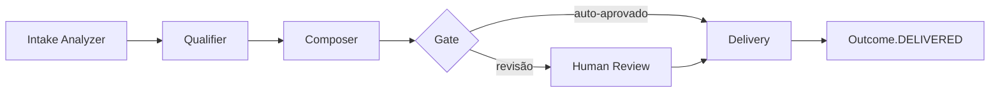

# SKU Spec — {{ sku_name }}

> **Princípio Constitution C2**: este documento começa pela cláusula contratual de outcome. Stack, prompts e código vêm depois.
> **Princípio Constitution C1**: nenhum SKU vai além de `status: draft` sem Diagnóstico Fase 0 vinculado.

---

## 1. Cláusula contratual de outcome (C2 — obrigatório)

### 1.1. Definição do outcome em uma frase

```
{{ Lead/Ticket/Documento/etc. é considerado X quando o agente {VERBO} e
   {CONDIÇÃO TÉCNICA OBSERVÁVEL} }}
```

> Esta frase vai literalmente para o contrato. Tem que ser legível por advogado e CEO.

### 1.2. Três exemplos POSITIVOS (casos que CONTAM)

| # | Descrição concreta do caso |
|---|---|
| 1 | {{ caso real e detalhado }} |
| 2 | {{ caso real e detalhado }} |
| 3 | {{ caso real e detalhado }} |

### 1.3. Três exemplos NEGATIVOS (casos parecidos que NÃO contam)

| # | Descrição | Por que NÃO conta |
|---|---|---|
| 1 | {{ caso de borda }} | {{ razão }} |
| 2 | {{ caso de borda }} | {{ razão }} |
| 3 | {{ caso de borda }} | {{ razão }} |

### 1.4. Janela temporal de estabilidade

`{{ 0h imediato / 24h / 72h / 7d }}`

**Justificativa**: {{ por que essa janela faz sentido para este SKU }}

### 1.5. Evento técnico que dispara `Outcome.status = DELIVERED`

{{ Webhook 200 OK do CRM / mensagem WhatsApp com status `delivered` / etc. }}

### 1.6. Aprovação contratual

- [ ] CEO aprovou redação
- [ ] Cliente assinou cláusula no contrato
- [ ] Definição passa no teste do "advogado naive" (legível sem jargão técnico)

---

## 2. Categorias de outcome (alimenta D6)

| Código | Descrição | Threshold mínimo de acurácia |
|---|---|---|
| `{{ codigo-1 }}` | {{ ... }} | {{ X% }} |
| `{{ codigo-2 }}` | {{ ... }} | {{ X% }} |
| `{{ codigo-3 }}` | {{ ... }} | {{ X% }} |

**Threshold agregado** (média ponderada por volume): `{{ X% }}`

> Detalhe completo em `docs/onda-N/sla-{{ sku_code }}.md`.

---

## 3. Fontes de input

### 3.1. Canal de entrada
- Tipo: `{{ WhatsApp Cloud API / webhook custom / email / planilha / etc. }}`
- Adapter implementado em: `src/adapters/webhook/{{ adapter-name }}.ts`
- Volume esperado: `{{ N/mês }}` por cliente típico

### 3.2. Trigger de pipeline
- Evento que enfileira job: {{ POST /webhooks/{{ canal }}/{tenantId} }}
- Job name: `outcome:start`
- Fila: `saas2`

### 3.3. Contexto consumido (Sincra)

| Tier | O que lê | Path |
|---|---|---|
| L0 | DNA, ICP, ofertas do tenant | `TenantContext` (cacheado, helper pattern) |
| L1 | BaselineCost, briefing | `Tenant`, `Briefing` |
| L2 | Histórico do tenant neste SKU | `Outcome[]` |

---

## 4. Pipeline de agentes

### 4.1. Diagrama (LangGraph)



### 4.2. Nodes detalhados

| Node | Modelo | Responsabilidade | Output |
|---|---|---|---|
| `intake-analyzer` | {{ Sonnet }} | Extrai entidades do input bruto | `IntakeAnalysis` |
| `qualifier` | {{ Sonnet/Opus }} | Classifica em categoria (§2) | `Qualification` |
| `composer` | {{ Sonnet }} | Gera resposta/ação proposta | `ProposedAction` |
| `gate` | (regra) | Auto-aprova se confidence ≥ X | passa ou bloqueia |
| `delivery` | (adapter) | Executa a ação no canal de saída | `DeliveryResult` |

### 4.3. Telemetria (C6)

Toda chamada LLM **deve** estar instrumentada via `langfuse.observe(...)`. Cada `Outcome` no DB referencia `trace_id` Langfuse correspondente.

---

## 5. Eval suite

- **Localização**: `evals/{{ sku_code }}/cases/`
- **Casos mínimos**: 30 (gate G2)
- **Recomendado**: 50–100 antes de promover a AUTONOMOUS
- **Atualização**: trimestral ou após drift detectado pelo reviewer DeepAgents

Cada caso usa `templates/eval-case.template.md`.

---

## 6. Unit economics

> Detalhe completo em `docs/onda-N/unit_economics-{{ sku_code }}.md`. Resumo aqui:

| Métrica | Valor |
|---|---|
| Tokens médios in/out por outcome (primário) | {{ X / Y }} |
| Custo por outcome (primário) | R$ {{ X }} |
| Custo por outcome (fallback) | R$ {{ X }} |
| Preço por outcome | R$ {{ X }} |
| Preço de plataforma fixa | R$ {{ X }}/mês |
| **Razão custo/preço** | **{{ X }}%** {{ ✅ ≤25% / ❌ }} |

---

## 7. Modos e gates de promoção

| Modo | Gate para promover | Critério |
|---|---|---|
| SHADOW | → ASSISTED | Concordância humano-vs-agente ≥ {{ X% }} em ≥ {{ N }} outcomes |
| ASSISTED | → AUTONOMOUS | Taxa de aprovação sem edição ≥ {{ Y% }} em ≥ {{ N }} outcomes |
| AUTONOMOUS | (steady state) | Taxa de erro pós-execução ≤ {{ Z% }} (= 1 − threshold §2) |

> Promoção via `/acme:promote --to=<modo>` (Forge-2). Validação por Promotion Officer (Forge-3).

---

## 8. Configuração por tenant (C8)

> Cliente novo do mesmo SKU = configuração, **não** branch. Variáveis de tenant abaixo:

| Campo | Tipo | Default | Exemplo |
|---|---|---|---|
| `tone_of_voice` | string | "neutro-profissional" | "informal" |
| `regras_negocio_especificas` | JSON | `{}` | `{ "atende_pj": true }` |
| `canal_saida` | enum | "whatsapp" | "email" |
| `outras_overrides` | ... | ... | ... |

Tudo isso vive em `TenantContext.skuConfig.{{ sku_code }}`.

---

## 9. Riscos específicos deste SKU

| Risco | Mitigação |
|---|---|
| {{ risco 1 }} | {{ ... }} |
| {{ risco 2 }} | {{ ... }} |

---

## 10. Histórico de versões

| Versão | Data | Mudança | Autor |
|---|---|---|---|
| 0.1.0 | {{ YYYY-MM-DD }} | Spec inicial | {{ nome }} |

---

## Checklist de pronto (gate G1 — Spec & Economics)

- [ ] §1 cláusula contratual completa e aprovada (C2)
- [ ] §2 categorias e thresholds definidos (referência D6)
- [ ] §3 canal e adapter implementados
- [ ] §4 pipeline LangGraph implementado em `src/skus/{{ sku_code }}/`
- [ ] §5 eval suite com ≥30 casos
- [ ] §6 unit economics passa regra C3 (≤25%)
- [ ] §7 gates de promoção configurados
- [ ] §8 configuração por tenant declarada
- [ ] Diagnóstico Fase 0 vinculado (C1)
- [ ] Telemetria Langfuse confirmada (C6)
